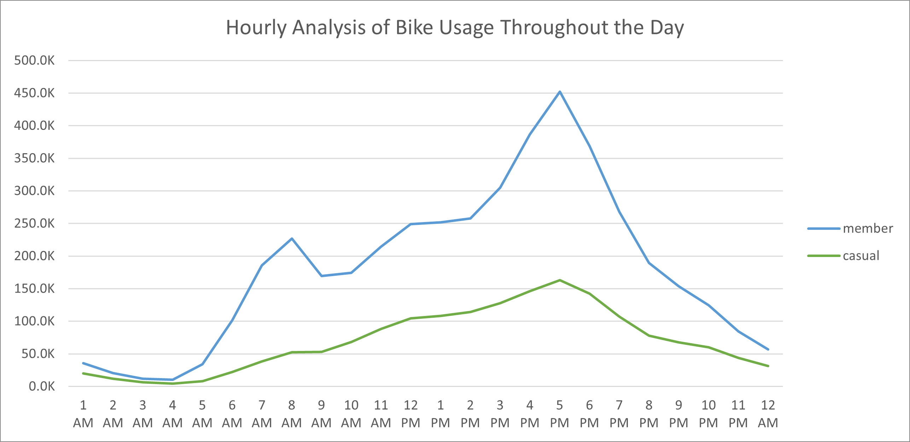
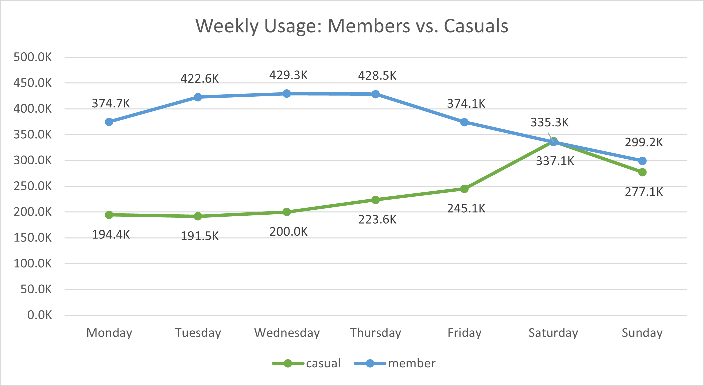
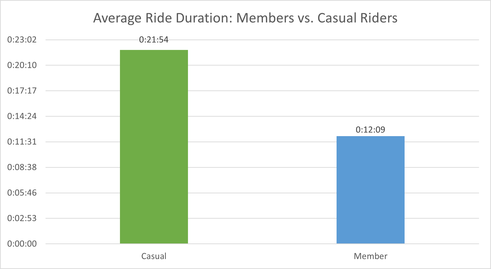
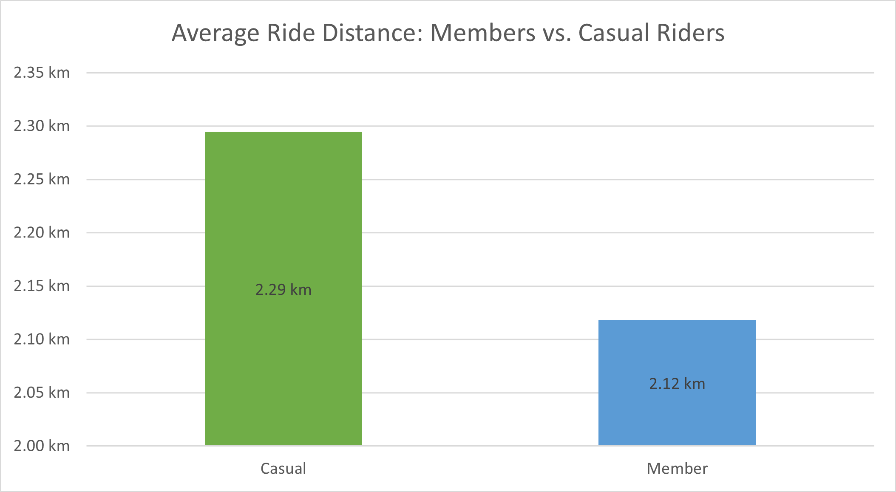
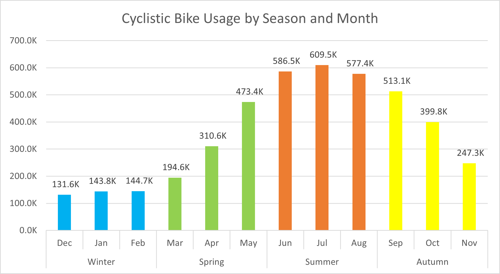

# **Google Data Analytics Capstone Project - Cyclistics Bikes**

## Background
 In 2016, Cyclistic launched a successful bike-share offering. Since then, the program has grown to a fleet of 5,824 bicycles that are geotracked and locked into a network of 692 stations across Chicago. The bikes can be unlocked from one station and returned to any other station in the system anytime.

Until now, Cyclistic’s marketing strategy relied on building general awareness and appealing to broad consumer segments. One approach that helped make these things possible was the flexibility of its pricing plans: single-ride passes, full-day passes, and annual memberships. Customers who purchase single-ride or full-day passes are referred to as casual riders. Customers who purchase annual memberships are Cyclistic members.

Cyclistic’s finance analysts have concluded that annual members are much more profitable than casual riders. Although the pricing flexibility helps Cyclistic attract more customers, Moreno believes that maximizing the number of annual members will be key to future growth. Rather than creating a marketing campaign that targets all-new customers, Moreno believes there is a very good chance to convert casual riders into members. She notes that casual riders are already aware of the Cyclistic program and have chosen Cyclistic for their mobility needs.

Moreno has set a clear goal: Design marketing strategies aimed at converting casual riders into annual members. In order to do that, however, the marketing analyst team needs to better understand how annual members and casual riders differ, why casual riders would buy a membership, and how digital media could affect their marketing tactics. Moreno and her team are interested in analyzing the Cyclistic historical bike trip data to identify trends.


Project Goal: To understand the differences in how annual members and casual riders use Cyclistic’s bikes and provide insights into their usage patterns, preferences, and behaviors. These insights will help the marketing team design strategies to convert more casual riders into annual members.

### **Data Overview**

* 5,800 bicycles and 600 docking stations installed around Chicago. <br>
* [Dataset](https://divvy-tripdata.s3.amazonaws.com/index.htm) consists of 12 CSV files each per month with 13 columns and 5,859,061 rows. <br>
* Data is stored in Amazon Web Server and is owned by Motivate International Inc under this [license](https://ride.divvybikes.com/data-license-agreement).

### ROCCC approach is used to determine the credibility of the data


* Reliable: The data is relevant, complete, consistent and it represents all bike rides taken in the city of Chicago for the selected duration of our analysis.
* Original: The data is made available by Motivate International Inc. which operates the city of Chicago.
* Comprehensive: The data covers a wide range of relevant variables, details including starting time, ending time, station name, station ID, type of membership and many more.
* Current: It is up-to-date as it includes data until end of April 2023. The data is cited and is available under Data License Agreement.

### **Data Limitation**
* Lack of demographic data like age or gender.<br>
* Absence of membership prices.<br>
* 27% of all electric bikes are missing the start station name.<br>

## **Prepare**
R is well-suited for cleaning and processing large datasets, data for this project has more than 5 million rows, so because of Its efficient memory management, vectorized operations, and extensive packages I have chosen R for cleaning and processing. Microsoft Excel to create the charts and Power Point to create the presentation.

### Installing and loading necessary packages
 ```ruby
install.packages("tidyverse")
install.packages("dplyr")
install.packages("writexl")

library(tidyverse)
library(dplyr)
library(writexl)
```
### Importing data to R Studio
```ruby
May_2022 <- read_csv("G:\\My Drive\\Data Analytics\\Capstone Project\\Data\\Tripdata\\202205-divvy-tripdata.csv")
June_2022 <- read_csv("G:\\My Drive\\Data Analytics\\Capstone Project\\Data\\Tripdata\\202206-divvy-tripdata.csv")
July_2022 <- read_csv("G:\\My Drive\\Data Analytics\\Capstone Project\\Data\\Tripdata\\202207-divvy-tripdata.csv")
August_2022 <- read_csv("G:\\My Drive\\Data Analytics\\Capstone Project\\Data\\Tripdata\\202208-divvy-tripdata.csv")
September_2022 <- read_csv("G:\\My Drive\\Data Analytics\\Capstone Project\\Data\\Tripdata\\202209-divvy-publictripdata.csv")
October_2022 <- read_csv("G:\\My Drive\\Data Analytics\\Capstone Project\\Data\\Tripdata\\202210-divvy-tripdata.csv")
November_2022 <- read_csv("G:\\My Drive\\Data Analytics\\Capstone Project\\Data\\Tripdata\\202211-divvy-tripdata.csv")
December_2022 <- read_csv("G:\\My Drive\\Data Analytics\\Capstone Project\\Data\\Tripdata\\202212-divvy-tripdata.csv")
January_2023 <- read_csv("G:\\My Drive\\Data Analytics\\Capstone Project\\Data\\Tripdata\\202301-divvy-tripdata.csv")
February_2023 <- read_csv("G:\\My Drive\\Data Analytics\\Capstone Project\\Data\\Tripdata\\202302-divvy-tripdata.csv")
March_2023 <- read_csv("G:\\My Drive\\Data Analytics\\Capstone Project\\Data\\Tripdata\\202303-divvy-tripdata.csv")
April_2023 <- read_csv("G:\\My Drive\\Data Analytics\\Capstone Project\\Data\\Tripdata\\202304-divvy-tripdata.csv")
```
### Merging data into a data frame
```ruby
trip_data <- rbind(May_2022, June_2022, July_2022, August_2022, September_2022, October_2022, November_2022, December_2022, January_2023, February_2023, March_2023, April_2023)
```
## Process - Cleaning

### Reviewing 
```ruby
nrow(trip_data)
ncol(trip_data)
head(trip_data)
tail(trip_data)
str(trip_data)
summary(trip_data)
colnames(trip_data)
```
### Removing NA's
```ruby
sum(is.na(trip_data))
trip_data <- na.omit(trip_data)
```

### Adding new columns for duration, distance, year, month, day of week and hour of day
```ruby
trip_data_v2 <- trip_data %>% 
mutate(ride_duration = difftime(ended_at, started_at, units = "mins")) %>% 
mutate(ride_distance = distHaversine(cbind(start_lng, start_lat), cbind(end_lng, end_lat))) %>% 
mutate(ride_year = year(started_at)) %>% 
mutate(ride_month = month(started_at, label = TRUE)) %>% 
mutate(day_of_week = weekdays(started_at)) %>% 
mutate(hour_of_day = hour(started_at))
```
### Cleaning data

      ##Trips w/o start station
      ##Trips w/o ending station
      ##Trips with duration > 0
      ##Trips with distance > 0
```ruby
clean_data <- trip_data_v2 %>% 
  filter(!is.na(start_station_name)) %>% 
  filter(!is.na(end_station_name)) %>% 
  filter(ride_duration >0) %>% 
  filter(ride_distance >0)
```
### Double checking cleaned data
```ruby
nrow(subset(clean_data, start_station_name < 0))
nrow(subset(clean_data, end_station_name < 0))
nrow(subset(clean_data, ride_distance < 0))
nrow(subset(clean_data, ride_duration < 0))
```

## **Analysis**

### Key Insights

<ol>
  <li>
    User Composition:
    <ul>
      <li>
        61% of all rides are performed by Members, indicating a significant user base within the bike share program.
        <br>
        <p align="center">
          
        </p>
      </li>
    </ul>
  </li>
  <li>
    Bike Preference:
    <ul>
      <li>
        Classic Bikes are more popular among users, indicating a preference for this bike type over other options. It would be interesting to explore the reasons behind this preference and assess if any improvements or adjustments can be made to cater to user preferences.
        <br>
        <p align="center">
          
        </p>
      </li>
    </ul>
  </li>
  <li>
    Usage Patterns by User Type:
    <ul>
      <li>
        Weekends are the busiest days for casual riders, suggesting that individuals use the bike share service for recreational purposes or weekend activities.
        <br>
        <p align="center">
          
        </p>
      </li>
      <li>
        Members tend to use the bikes more during the weekdays, implying that they utilize the bikes for commuting to work or other regular activities. This observation is further supported by the hourly analysis, which shows usage peaks at 7-8 AM and 4-5 PM, aligning with typical commuting hours.
        <br>
        <p align="center">
          
        </p>
      </li>
    </ul>
  </li>
  <li>
    Ride Duration and Distance:
    <ul>
      <li>
        Casual rides typically take longer than rides by members, indicating that casual users may engage in more leisurely or exploratory trips. Understanding the factors contributing to longer casual rides can help tailor marketing efforts or develop targeted services to cater to their preferences.
      </li>
      <li>
        Casual riders also cover more distances compared to members, suggesting a different usage pattern or purpose for bike usage. Exploring the reasons behind this difference can provide insights into the needs and motivations of different user segments.
     </li>
    </ul>
 <div style="white-space: nowrap;">
  
  
</div>
  </li>
  <li>
    Seasonal Trends:
    <ul>
      <li>
        Summer and Autumn emerge as the busiest seasons for bike usage. This trend could be attributed to favorable weather conditions during these seasons, making cycling a more appealing mode of transportation or leisure activity. It would be valuable to analyze the impact of weather conditions on bike usage and explore strategies to maintain user engagement during less favorable seasons.
      </li>
    </ul>
  </li>
</ol>
        <p align="center">
          
        </p>


## Conclusions
<ul>
  <li>
    <strong>Targeted Marketing:</strong> Develop marketing campaigns that highlight the benefits of membership, such as cost savings, exclusive perks, or priority access to bikes during peak hours. Emphasize how becoming a member can enhance their overall biking experience.
  </li>
  <li>
    <strong>Flexible Membership Options:</strong> Offer flexible membership plans tailored to the needs of casual users. For example, introduce short-term or pay-as-you-go options that provide the convenience and cost-effectiveness of membership without a long-term commitment.
  </li>
  <li>
    <strong>Membership Savings:</strong> Showcase the potential savings by becoming a member. Highlight the reduced rates, discounted fees for longer rides, and any other exclusive benefits that members enjoy.
  </li>
  <li>
    <strong>Incentives and Rewards:</strong> Create incentives for casual users to become members, such as discounted membership rates, referral programs, or loyalty rewards. Encourage current members to refer casual users by offering rewards or discounts for successful referrals.
  </li>
</ul>
